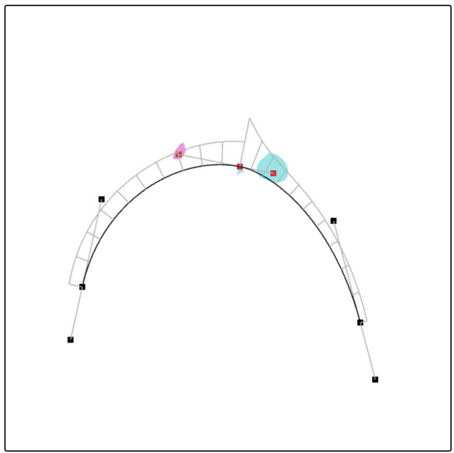
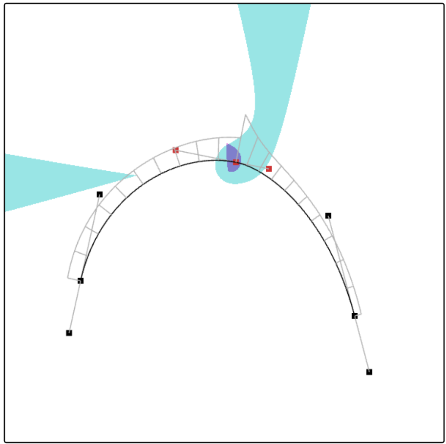

# Curve Tool with the visualization of curvature monotonicity regions

- This repository contains prototype code for a curve tool, similar to the one in Adobe Illustrator, but with a visualization of the curvature monotonicity region.
- An original curve tool with the visualization of the curvature monotonicity region was proposed in [2], and I have ported that program to JavaScript.
- Refer to [1,2,3] for detail.
- The code uses polynomial cubic Bézier curves.
- For the visualization of the curuvature monotonicity region, a GPU is required.
  
# How to use

- Open jsBezier.html.
- Click and drag to draw a curve.
- Press ENTER or Ctrl+click to end the curve.
- Drag a control point to move it and its two associated points.
- Press Alt (or Option for Mac) and move a control point to make the curve G^0.
- Select a control point and press Delete to delete three consecutive points. Click again to deselect.
- Use the arrow keys to translate and +/- to scale.
- The purple region indicates that the curvature of the left (previous) curve will be monotonically varying if the corresponding control point is within the region.
- The cyan region indicates that the curvature of the right (next) curve will be monotonically varying if the corresponding control point is within the region.

- If the control point connecting the two curve segments is within both the purple and cyan regions, the curvatures of the two curves connected by that control point are both monotonically varying.

- If one of the control point is within its corresponding curvature monotonicity region, all the other control poijnts are also within their curvature monotonicity regions.
- For cubic Bézier curves, if the distance between the first two or the last two control points is small, the curvature becomes very large.

# Licence
The code in this repository is licenced under ther terms of Apache-2 license.

# Contributions
Contributioons are welcome.

# References
[1] Takafumi Saito and Norimasa Yoshida, Curvature monotonicity evaluation functions on rational Bézier curves. Computers & Graphics, Vol. 114, pp.219-229, Aug. 2023. [https://doi.org/10.1016/j.cag.2023.05.019](https://doi.org/10.1016/j.cag.2023.05.019)

[2] Norimasa Yoshida, Seiya Sakurai, Hikaru Yasuda, Taisei Inoue and Takafumi Saito, Visualization of the Curvature Monotonicity Regions of Polynomial Curves and its Application to Curve Design, Computer-Aided Design and Applications, Vol. 21, No.1, pp.75-87, Jan. 2024. [[https://doi.org/10.14733/cadaps.2024.75-87]([https://doi.org/10.14733/cadaps.2024.75-87](https://doi.org/10.14733/cadaps.2024.75-87))](https://doi.org/10.14733/cadaps.2024.75-87)

[3] Norimasa Yoshida, Takafumi Saito, Curvature Monotonicity Regions of 2D Polynomial and Rational Bézier Curves as the Intersection of Implicit Regions, Computer-Aided Design and Applications, Vol. 22, No. 1, pp.68-80, Jan. 2025.  [https://doi.org/10.14733/cadaps.2025.68-80](https://doi.org/10.14733/cadaps.2025.68-80)

[Norimasa Yoshida](https://sites.google.com/view/yoshida-lab-citnu/english/profile-e)
